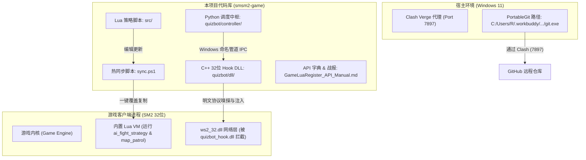

# SM2_Game — AI 协同开发与自主运行指南 (AI Agent Guide)

> **目标受众**：接手本项目的 AI Agent（无论是 Claude、GPT、Gemini 还是其他自主编码智能体）。  
> **设计目的**：消除环境上下文断层，避免踩进本地特殊环境（Git 路径、网络代理、进程死锁、游戏内热更新）的各类深坑，指导后续 Agent 安全、规范、高效地完成自动化逆向、代码重构与功能扩展。

---

## 1. 项目基础信息与架构蓝图

* **项目名称**：`SM2_Game` (什么什么大冒险2.0 自动化系统与逆向工程)
* **工作区根目录**：`d:\Codes\GG_Antigravity\smsm2-game`
* **远程仓库**：`https://github.com/GeekerYxs/SM2_Game.git` (主分支: `main`)
* **目标游戏环境**：
  * 游戏为 32 位（x86）Windows MMORPG 客户端。
  * 本地游戏安装路径：位于 `D:\` 盘，根目录名称匹配 `*2.0`（例如 `D:\什么什么大冒险2.0`）。
  * 游戏内置 Lua 虚拟机：Lua 5.1 / LuaJIT，挂载了大量的原生 C++ 导出 API。

### 核心子系统架构



---

## 2. 开发者环境“深坑”与硬性规则（必读！）

作为 AI Agent，在宿主环境执行 Shell 命令时，**必须无条件遵守以下规则**，否则必然导致命令超时或报错。

### 规则 1：Git 未配置全局环境变量 (PATH)
* **现象**：在 PowerShell 中直接执行 `git` 会报错 `术语 'git' 不会被识别为 cmdlet`。
* **原因**：宿主环境使用的便携式 Git 位于专用运行时目录中。
* **Git 绝对路径**：
  ```text
  C:\Users\R\.workbuddy\binaries\PortableGit\versions\1.2.0\cmd\git.exe
  ```
* **正确调用方式**（PowerShell）：
  ```powershell
  $git = "C:\Users\R\.workbuddy\binaries\PortableGit\versions\1.2.0\cmd\git.exe"
  & $git status
  ```
  或者在脚本会话前临时注入 PATH：
  ```powershell
  $env:PATH = "C:\Users\R\.workbuddy\binaries\PortableGit\versions\1.2.0\cmd;" + $env:PATH
  ```

### 规则 2：本地网络代理必须走 Clash Verge (Port 7897)
* **现象**：访问 GitHub 直连超时、丢包或报 TLS 错误。
* **原因**：本地代理软件为 **Clash Verge（内核 mihomo）**，监听端口为 **`7897`**（**不是**常见的 7890 或 10808）。而且 Git/curl 命令行使用的是内置 libcurl，**完全不走 Windows 系统的图形化系统代理**。
* **解决方案**：
  * **Git 配置**（本仓库已配置，若在新克隆环境下需重新执行）：
    ```powershell
    & $git config http.proxy http://127.0.0.1:7897
    & $git config https.proxy http://127.0.0.1:7897
    ```
  * **PowerShell / Python 环境变量**：
    ```powershell
    $env:HTTP_PROXY = "http://127.0.0.1:7897"
    $env:HTTPS_PROXY = "http://127.0.0.1:7897"
    ```

### 规则 3：Git 凭据选择器死锁与远程 URL 格式
* **现象**：后台执行 `git push` 时进程永久挂起，无任何输出。
* **原因 1（凭据助手死等交互）**：PortableGit 默认携带了 `credential.helper = helper-selector`，在没有终端界面的 Agent 环境下，它会启动 `git-credential-helper-selector.exe get` 并无限等待用户从键盘输入编号，造成死锁。
  * **防范措施**：推送时必须显式禁用该交互助手：
    ```powershell
    & $git config credential.helper ""
    ```
* **原因 2（URL 鉴权格式错误）**：若将 URL 写为 `https://<TOKEN>@github.com/...`，Git 会将 Token 当作**用户名**，进而触发密码询问。
  * **标准格式**：必须在 Token 前显式声明用户名或伪用户：
    ```text
    https://x-access-token:<TOKEN>@github.com/GeekerYxs/SM2_Game.git
    # 或
    https://GeekerYxs:<TOKEN>@github.com/GeekerYxs/SM2_Game.git
    ```

---

## 3. 各子系统详解与核心文件清单

### A. 自动战斗决策大脑 (`src/ai_fight_strategy.lua`)
* **定位**：运行于游戏内置 Lua VM，负责回合制战斗中全队的技能释放决策与状态机流转。
* **核心职责**：
  1. **优先级调度**：紧急自保吃药（HP < 30%） -> 队伍濒死复活/加血 -> 控制/封印敌方危险单位 -> 优先集火脆皮/后排/残血 -> 群攻清杂 -> 普攻/补蓝回怒。
  2. **角色与宠物解耦**：分别实现人物动作决策与宠物（召唤兽）动作决策。
  3. **防御式编程规范**：游戏内核 C++ 对象若已死亡或离场，直接调用其方法会导致游戏**瞬退闪退**。任何对象访问前必须做有效性校验：
     ```lua
     if target and target:IsValid() and not target:IsDead() then
         -- 执行动作
     end
     ```

### B. 地图巡逻与遇敌挂机 (`src/map_patrol.lua`)
* **定位**：控制角色在野外地图走动，触发遇敌暗雷。
* **运行模式**：
  * **`AutoAnchor`（自动锚点模式）**：以当前角色所在坐标为中心，自动探测周围可移动点并在 A-B 两点间往返巡逻。
  * **`Custom`（自定义坐标模式）**：外部传入 PointA(x1, y1) 与 PointB(x2, y2)，角色在指定航线往返。
* **状态报告与 IPC**：
  * 会持续向同目录写入状态信息（包含 `LeaderName`, `MapID`, `PlayerX`, `PlayerY`, `State`, `Target`, `InFight` 等），供外部 GUI/监控程序读取。
  * **队长机制**：仅队伍队长号响应外部移动指令，避免队员逻辑冲突导致走动打架。

### C. 游戏内热更新与同步脚本 (`sync.ps1`)
* **极为重要**：在本项目工作区中修改 `src/*.lua`，**并不会自动影响正在运行的游戏**！
* 游戏客户端直接加载的是游戏安装目录中的文件。
* **操作工作流**：
  只要修改了 `src/ai_fight_strategy.lua` 或 `src/map_patrol.lua`，**必须立即执行**工作区根目录的同步脚本：
  ```powershell
  powershell -ExecutionPolicy Bypass -File d:\Codes\GG_Antigravity\smsm2-game\sync.ps1
  ```
  该脚本会自动搜索 `D:\*2.0` 并将最新的 Lua 代码精准覆盖到游戏实装目录。

### D. 静默答题机器人 (`quizbot/`)
* **架构**：C++ IAT Hook + Windows 命名管道 + Python 智能中枢。
* **目录结构**：
  * `quizbot/dll/`: 32 位 Hook 动态库源码（拦截 `ws2_32.dll` 收发包，完成 S2C/C2S 置换表双向加解密，透明透传，不抢焦点不破画面）。
  * `quizbot/injector/`: 注入器，负责将 Hook DLL 注入所有匹配的游戏进程。
  * `quizbot/controller/quizbot.py`: Python 控制中心，维护多开管道通信、题库查询、LLM 智能解题与排除法兜底。
  * `quizbot/data/bank.json`: 题目沉淀数据库。
  * `quizbot/启动自动答题.bat`: 宿主端一键启动批处理。

### E. 权威逆向与 API 知识库
* **`GameLuaRegister_API_Manual.md`**：【核心宝典】
  * 逆向提取出的游戏内原生 C++ 导出 Lua API 完整清单。
  * 涵盖 `game:*`、`gamestate:*`、`team:*`、`player:*`、`fight:*` 等原生方法签名与调用方式。
  * **Agent 严禁凭空捏造 API**，编写任何新功能前**必须先检索该手册**确认方法是否存在。
* **`official_luas/` & `extracted_luas/`**：
  * 官方原版与反编译提取出的 Lua 代码。属于只读参考资料，**千万不要随意修改或删除**，用于逆向对照官方逻辑。
* **`battle_history/`**：
  * 战斗快照与遥测数据日志（JSONL 格式），记录了伤害、命中、出手顺序等真实数据，可用于回归测试和策略调优。

---

## 4. 目录树快速参考

```text
d:\Codes\GG_Antigravity\smsm2-game\
├── .git/                                # Git 版本控制目录
├── .gitignore                           # Git 忽略配置
├── AI_AGENT_GUIDE.md                    # [当前文档] 专为 AI Agent 设计的实操规范与指引
├── AI战斗策略引擎与实装报告.md          # 战斗 AI 实装细节、算法与效果验证报告
├── GameLuaRegister_API_Manual.md        # 客户端 C++ 导出 Lua API 权威速查手册
├── README.md                            # 项目总体概述与人类开发者指引
├── sync.ps1                             # 关键脚本：同步 src/ 脚本至 D:\*2.0 游戏客户端
├── 测试.txt                             # Git 推送与联通性验证测试文件
│
├── src/                                 # 核心业务逻辑（主动维护区）
│   ├── ai_fight_strategy.lua            # 核心战斗策略状态机（人物与宠物决策）
│   ├── auto_fight.lua                   # 挂机遇敌主入口
│   └── map_patrol.lua                   # 地图巡逻引擎（AutoAnchor / Custom 模式）
│
├── quizbot/                             # 自动化答题子系统
│   ├── 启动自动答题.bat                 # 一键运行入口
│   ├── controller/                      # Python 调度中枢与题库查询
│   ├── dll/                             # 32 位 IAT Hook 源码与置换加解密
│   ├── injector/                        # DLL 注入程序
│   ├── data/bank.json                   # 沉淀的答题题库
│   └── logs/                            # 答题与战斗结算账本
│
├── official_luas/                       # 官方客户端提取的原始脚本（只读参考）
├── extracted_luas/                      # 反编译脚本分析库（只读参考）
├── battle_history/                      # 实战切片遥测日志（JSONL）
└── tools/                               # 逆向辅助与提取测试工具箱
```

---

## 5. AI Agent 标准行动工作流 (Playbook)

### 场景 1：修改或增强战斗/巡逻 Lua 逻辑
1. **查阅 API 手册**：核验拟调用的游戏 API 是否存在于 `GameLuaRegister_API_Manual.md`。
2. **编辑代码**：直接修改 `src/ai_fight_strategy.lua` 或 `src/map_patrol.lua`。
   * 注意所有的指针空安全（`IsValid()`, `nil` 判断）。
3. **推送到本地运行端**：
   ```powershell
   powershell -ExecutionPolicy Bypass -File d:\Codes\GG_Antigravity\smsm2-game\sync.ps1
   ```
4. **提交并推送到 GitHub**（使用完整 Git 路径与规范 Commit）：
   ```powershell
   $git = "C:\Users\R\.workbuddy\binaries\PortableGit\versions\1.2.0\cmd\git.exe"
   & $git add src/
   & $git commit -m "feat(combat): optimize healer priority logic"
   & $git push origin main
   ```

### 场景 2：维护题库与协议变更
1. 若游戏更新了答题协议封包 ID 或加密置换表：
   * 修改 `quizbot/dll/quiz_protocol.h`。
   * 使用 MinGW 32 位（i686）重新构建 DLL 与注入器。
2. 若需补充新题库：
   * 编辑 `quizbot/data/bank.json`，确保 JSON 格式合法。

### 场景 3：排查 Git 提交或推送异常
遇到网络无法连接或推送报错时，按以下顺序自检：
1. 检查 Clash Verge 是否在运行（7897 端口是否监听）：
   ```powershell
   Get-NetTCPConnection -LocalPort 7897 -State Listen
   ```
2. 检查 Git 代理配置：
   ```powershell
   $git = "C:\Users\R\.workbuddy\binaries\PortableGit\versions\1.2.0\cmd\git.exe"
   & $git config --get http.proxy
   ```
3. 检查是否有挂起的 `git-credential-helper-selector` 僵尸进程在卡死：
   ```powershell
   Get-Process | Where-Object { $_.ProcessName -like "*git*" }
   ```
   若存在，立即 `Stop-Process -Force` 清理。
4. 检查当前 GitHub Token 是否有效：
   ```powershell
   $token = "ghp_xxxxxxxxxxxx"
   curl.exe -x http://127.0.0.1:7897 -H "Authorization: token $token" https://api.github.com/user
   ```

---

> **结语**：遵循上述规范，保持代码优雅严谨，善用 `sync.ps1` 和 API 手册，即可在完全无人工干预的情况下高效接盘本项目！
