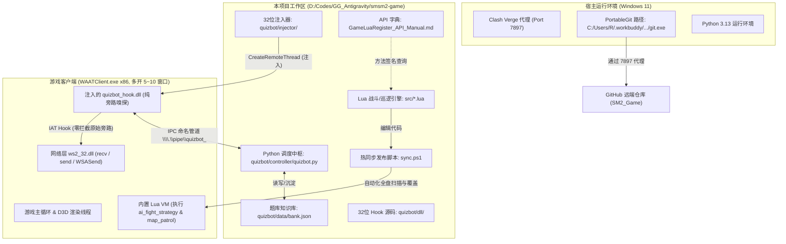
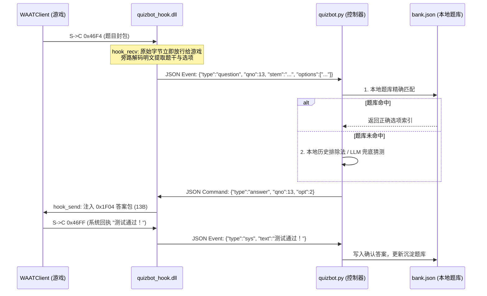

# SM2_Game — AI 协同开发与代码审计权威指南 (AI Agent Audit & Development Manual)

> **目标受众**：接手本项目的任何后续 AI Agent（Claude, GPT, Gemini, DeepSeek, Cursor 等）。  
> **核心使命**：全面揭示本项目（《什么什么大冒险2.0》多开挂机、战斗AI引擎、底层协议逆向与自动答题系统）的底层机制、历史故障根因、开发与环境硬性规则，指导后续 Agent 安全高效地完成代码审计与缺陷修复。

---

## 目录
1. [项目全景架构与工作流](#1-项目全景架构与工作流)
2. [开发者环境“五大深坑”与硬性规则（必读）](#2-开发者环境五大深坑与硬性规则必读)
3. [核心子系统 A：自动战斗与巡逻 AI 引擎 (`src/`)](#3-核心子系统-a自动战斗与巡逻-ai-引擎-src)
4. [核心子系统 B：自动答题系统 (`quizbot/`) 深度逆向与协议全解](#4-核心子系统-b自动答题系统-quizbot-深度逆向与协议全解)
5. [历史踩坑复盘与关键故障审计分析（重中之重）](#5-历史踩坑复盘与关键故障审计分析重中之重)
6. [给后续 AI Agent 的核心审计与任务清单](#6-给后续-ai-agent-的核心审计与任务清单)
7. [代码仓库全景目录索引](#7-代码仓库全景目录索引)
8. [自动化运维与命令行备忘录](#8-自动化运维与命令行备忘录)

---

## 1. 项目全景架构与工作流

本项目服务于 32 位（x86）Windows MMORPG 经典网游《什么什么大冒险2.0》（客户端可执行程序为 `WAATClient.exe`）。

整个工程分为两大主干模块：
1. **游戏内战斗决策与挂机引擎 (`src/`)**：基于游戏客户端内置 Lua 虚拟机（Lua 5.1/LuaJIT），直接调用游戏 C++ 导出的原生 API，实现全自动回合制战斗与野外巡逻遇敌。
2. **外部网络层答题机器人 (`quizbot/`)**：基于 IAT Hook 技术拦截底层网络收发包（`ws2_32.dll`），使用动态内存提取的双射置换表解密流量，通过 Windows 命名管道与 Python 调度中枢通信，实现多开静默答题防暂离。

### 系统架构拓扑图



---

## 2. 开发者环境“五大深坑”与硬性规则（必读）

作为后续接手的 AI Agent，在宿主环境调用系统命令与维护代码时，**必须严格遵守以下规则，违者必然导致超时、挂死或游戏崩溃**：

### 规则 1：Git 未配置全局系统 PATH
* **现象**：直接运行 `git status` 报错 `术语 'git' 未被识别为 cmdlet...`。
* **原因**：宿主环境使用的便携式 Git 位于专属路径。
* **Git 绝对路径**：
  ```text
  C:\Users\R\.workbuddy\binaries\PortableGit\versions\1.2.0\cmd\git.exe
  ```
* **正确调用方式**（PowerShell）：
  ```powershell
  $git = "C:\Users\R\.workbuddy\binaries\PortableGit\versions\1.2.0\cmd\git.exe"
  & $git status
  ```

### 规则 2：网络代理必须走 Clash Verge 7897 端口
* **现象**：访问 GitHub 提示超时、连接重置或 SSL 报错。
* **原因**：本地代理软件为 Clash Verge（mihomo 内核），监听端口为 **`7897`**（**不是**常见的 7890/10808）。Git 与 curl 命令行走的是内置网络栈，不继承 Windows 系统的可视化代理。
* **代理配置方式**：
  ```powershell
  & $git config http.proxy http://127.0.0.1:7897
  & $git config https.proxy http://127.0.0.1:7897
  $env:HTTP_PROXY = "http://127.0.0.1:7897"
  $env:HTTPS_PROXY = "http://127.0.0.1:7897"
  ```

### 规则 3：Git 凭据助手在无头环境下的挂死问题
* **现象**：执行 `git push` 无限期挂起，无任何输出。
* **原因**：PortableGit 默认携带 `credential.helper = helper-selector`，在无交互界面的 Agent 环境下，它会启动 `git-credential-helper-selector.exe` 并无限等待标准输入编号。
* **防范方案**：
  ```powershell
  & $git config credential.helper ""
  ```
  远端 URL 格式需显式携带认证标记：
  ```text
  https://x-access-token:<TOKEN>@github.com/GeekerYxs/SM2_Game.git
  ```

### 规则 4：Windows 批处理 (.bat) 与控制台中文编码陷阱
* **现象**：运行批处理脚本闪退，或控制台打印乱码。
* **原因**：Windows 中文控制台默认代码页为 `CP936` (GBK)。若 `.bat` 文件以 UTF-8 编码保存且第一行未切换代码页，CMD 会因语法解析错误直接退出！
* **铁律**：所有供用户或宿主运行的 `.bat` 文件，第一行必须使用：
  ```bat
  @echo off
  chcp 65001 >nul
  ```
  并在关键步骤后添加错误捕获与 `pause`，严禁让窗口静默退出。

### 规则 5：32位（x86）体系架构与编译工具链
* **目标进程**：`WAATClient.exe` 是典型的 32 位（x86 PE32）进程。
* **铁律**：注入的 `quizbot_hook.dll` 与 `injector.exe` **必须使用 32 位 MinGW/GCC (i686-w64-mingw32) 编译**！任何 64 位（x86_64）二进制文件注入均会导致目标进程崩溃或 `CreateRemoteThread` 失败。
* 仓库中的 `quizbot/build/` 已包含编译好的 32 位二进制，若无底层协议修改无需重复编译。

---

## 3. 核心子系统 A：自动战斗与巡逻 AI 引擎 (`src/`)

### 1. 架构定位
* **`src/ai_fight_strategy.lua`**：核心战斗决策状态机。在每个战斗回合，它会评估玩家角色和宠物的当前状态，按策略优先级决定动作（吃药救急 -> 团队复活/治疗 -> 危险单位控制/封印 -> 集火残血/关键怪 -> 群攻清场 -> 普攻/补蓝）。
* **`src/map_patrol.lua`**：地图巡逻与遇敌挂机引擎。支持两套工作模式：
  - **`AutoAnchor`（自动锚点模式）**：以初始坐标为中心，自动探测合法可行走网格，在 A-B 两点往返移动触发暗雷。
  - **`Custom`（自定义路径模式）**：由外部传入自定义坐标点进行航线巡逻。
* **`src/auto_fight.lua`**：战斗挂机调度主入口。

### 2. API 字典手册使用规则 (`GameLuaRegister_API_Manual.md`)
* 项目根目录下的 [`GameLuaRegister_API_Manual.md`](file:///d:/Codes/GG_Antigravity/smsm2-game/GameLuaRegister_API_Manual.md) 是通过逆向客户端符号表提取出的真实 C++ 导出 API 清单。
* **Agent 严禁凭空捏造 API 方法**。在增加新逻辑前，必须查阅该手册确认方法签名（如 `fight:GetCurActor()`, `player:GetHP()`, `team:GetMemberCount()` 等）。

### 3. 防闪退编程规范（防御式编程）
游戏底层 C++ 与 Lua 交互时，若对象指针已失效（如单位死亡、离场、切换地图），直接调用其方法会导致游戏进程瞬间崩溃并抛出 `WAATClient.rpt` 崩溃日志。
* **编写规则**：所有对象在访问方法前，必须进行三级合法性校验：
  ```lua
  if target and target:IsValid() and not target:IsDead() then
      -- 执行操作
  end
  ```

### 4. 关键发布流程：`sync.ps1`
* **重要事实**：直接修改工作区的 `src/*.lua` **不会**直接影响正在运行的游戏！
* 游戏客户端直接加载的是游戏安装目录（如 `D:\什么什么大冒险2.0\v2.1\Win32\Lua\*.lua`）。
* **标准操作规范**：
  每次修改完 `src/` 代码后，必须立即在根目录下运行：
  ```powershell
  powershell -ExecutionPolicy Bypass -File d:\Codes\GG_Antigravity\smsm2-game\sync.ps1
  ```
  该脚本会自动全盘扫描 `D:\*2.0` 并将最新代码精准同步至游戏目录。

---

## 4. 核心子系统 B：自动答题系统 (`quizbot/`) 深度逆向与协议全解

### 1. 协议帧格式与混淆编解码 (Wire Protocol Specification)

所有网络传输帧均由 4 字节帧头与可变正文构成：
```text
 0               1               2               3
+-+-+-+-+-+-+-+-+-+-+-+-+-+-+-+-+-+-+-+-+-+-+-+-+-+-+-+-+-+-+-+-+
|       inv (uint16_t LE)       |        op (uint16_t LE)       |
+-+-+-+-+-+-+-+-+-+-+-+-+-+-+-+-+-+-+-+-+-+-+-+-+-+-+-+-+-+-+-+-+
|                       混淆正文字节流 (length 字节)              ...
+-+-+-+-+-+-+-+-+-+-+-+-+-+-+-+-+-+-+-+-+-+-+-+-+-+-+-+-+-+-+-+-+
```

* **正文长度计算**：
  $$\text{length} = (\sim \text{inv}) \ \& \ \text{0xFFFF}$$
* **混淆表索引计算**：
  $$\text{index} = ((\text{op} \ll 8) \oplus \text{inv}) \pmod{10}$$
* **逐字节置换加解密**：
  正文的第 $i$ 个字节使用表组中的第 $(\text{index} + i) \pmod{10}$ 张表完成字节代换。
  - S $\to$ C（下行明文）：`plain[i] = dec_tables[(index + i) % 10][wire[i]]`
  - C $\to$ S（上行密文）：`wire[i] = enc_tables[(index + i) % 10][plain[i]]`

### 2. 内存置换表动态提取机制 (`load_codec`)
客户端内存中保存了 10 张双射置换表。DLL 在加载时通过 `ReadProcessMemory` 动态读取游戏主模块内存：
- `base + 0x515D6C`：包含 10 个指针，指向 C $\to$ S 加密置换表。
- `base + 0x515D94`：包含 10 个指针，指向 S $\to$ C 解密置换表。
- 读取后验证双射性（每个字节 $0\sim 255$ 恰好出现一次），验证成功后激活编解码器。静态备份参考 `quizbot/codec/codec_tables.json`。

### 3. 核心协议 Opcode 字典

| Opcode | 方向 | 名称 | 线上帧长 | 明文结构与字段解析 |
|---|:---:|---|:---:|---|
| **`0x46F4`** | S $\to$ C | **题目下发** | 可变 | `[field_a: 4B][flag: 1B=0x01][qno: 4B u32][stem_len: 1B][stem: GBK][opt_cnt: 1B][opt1_len: 1B][opt1: GBK]...` |
| **`0x1F04`** | C $\to$ S | **提交答案** | 13B 固定 | `inv=0xFFF6` (len=9), `op=0x1F04`。<br>明文：`[0x05, 0x00, 0x00, 0x00][qno: 4B u32][opt_idx: 1B u8]` |
| **`0x46FF`** | S $\to$ C | 系统提示 | 可变 | `[201021: 4B][len: 4B][text: GBK]`。若包含 "测试通过！" 则确认答对 |
| **`0x472A`** | S $\to$ C | 战斗结算 | 可变 | `[gold: 4B @offset 0][exp: 4B @offset 4]...` 用于经验与收益统计 |
| **`0x40E5`** | S $\to$ C | 货币更新 | 12B | `[a: 4B][b: 4B]` |
| **`0x0FFF`** | C $\to$ S | 账号登录 | 264B | 包含账号密码及版本校验 |
| **`0x1F51`** | C $\to$ S | 网络心跳 | 12B | 客户端周期性保活包 |

### 4. IPC 通信协议 (`\\.\pipe\quizbot_<pid>`)

DLL 与 Python 控制器之间通过具名管道进行基于行分隔的 UTF-8 JSON 交互：



---

## 5. 历史踩坑复盘与关键故障审计分析（重中之重）

在项目演进过程中（GLM 5.3 Flash 维护至 v13 版本期间），由于违反了游戏逆向工程的核心禁忌，曾出现多次恶性 Bug。**后续 Agent 必须深刻理解以下故障机理，严防重蹈覆辙**：

### 故障 1：尝试“拦截弹窗”与“模拟点击”引发的全面崩溃与闪退（核心教训）
* **错误尝试**：
  由于答题完成后游戏界面依然会浮动答题确认对话框，早期的修改试图通过以下方式屏蔽该弹窗：
  1. 试图在网络层（`StreamFilter`）将 `0x46F4` 题目帧强行扣留不交给游戏。
  2. 试图通过 Win32 Hook (`SetWindowsHookEx`, `CallWindowProc`) 拦截弹窗创建，或在后台发送 `BM_CLICK` / `WM_LBUTTONDOWN` 模拟点击关闭按钮。
* **崩溃根因分析**：
  1. **Winsock 状态机破坏**：游戏客户端使用 `WSAEventSelect` 异步事件驱动。当网络层 `hook_recv` 拦截并吃掉 `0x46F4` 封包、返回长度为 0 或阻塞时，底层套接字触发了非预期的空事件或连接终止判定，直接导致**角色一登录游戏就立刻掉线**。
  2. **渲染与消息循环竞态（Crash!）**：游戏主窗口使用老旧的 Direct3D 与定制 UI 库，其界面组件没有跨线程安全保证。外部注入线程在未经游戏主线程同步的情况下触碰窗口句柄或拦截窗口过程，直接触发空指针解引用和段错误，生成 `WAATClient.rpt` 崩溃转储文件，客户端瞬间退散！
* **用户绝对指令与不可逆原则**：
  > **“还原成纯网络层答题就行了，不要去动答题弹窗拦截和点击。越复杂越容易出错。只要答题在网络层完成了，浮窗停留在界面上完全无害，挂机无需理会！”**
* **现行架构保证**：
  DLL 中的 `hook_recv` 采用 **100% 原始透传旁路机制**：
  ```cpp
  static int WINAPI hook_recv(SOCKET s, char* buf, int len, int flags) {
      int r0 = p_recv(s, buf, len, flags);
      if (r0 > 0) {
          on_recv_data_bypass(s, (const uint8_t*)buf, r0); // 纯旁路只读复制
      }
      return r0; // 原始字节 0 延迟、0 丢弃交付游戏引擎
  }
  ```

### 故障 2：角色掉线与套接字失联 (`g_main_sock` 脱钩)
* **故障现象**：挂机数小时后，某个号（如“伏地魔2”）出现题目下发但控制器报错 `[SEND-ANSWER] no main sock` 或角色断线。
* **根因分析**：
  1. 游戏在从登录服务器切换到大区世界服务器（或换线/过图）时，会关闭原套接字并创建新套接字。
  2. 原 `hook_closesocket` 会在旧套接字关闭时把 `g_main_sock` 置为 `INVALID_SOCKET`。若此时后续连接没有走 8484 端口，导致 `hook_connect` 没能捕获到新套接字，答题器便找不到发包目标。
  3. **修复措施**：在 `hook_send` 与 `hook_WSASend` 中增加了启发式特征码嗅探（当检测到客户端向外发送 `0xF001` / `0x47C0` / `0x4101` 业务包时，动态纠正并更新 `g_main_sock`）。

### 故障 3：多客户端检测与热注入断层
* **用户需求**：玩家通常先开 5 个客户端，脚本需全部自动注入；随后可能再开 5 个客户端，脚本必须自动巡检并为新客户端注入，且**绝对不能对已有客户端产生干扰或重复注入**。
* **现行方案**：
  - `quizbot.py` 的主循环 `scan()` 周期性扫描 `WAATClient.exe` 列表。
  - 使用 `injector.exe --pid <pid>` 单独定向注入。注入器通过 `CreateToolhelp32Snapshot(TH32CS_SNAPMODULE)` 先行检测 `quizbot_hook.dll` 是否已在模块列表中，若已存在则直接返回 `already injected` 跳过，做到零冲击。

---

## 6. 给后续 AI Agent 的核心审计与任务清单

作为审计或修复本项目的 AI Agent，请按照以下优先级依次核查与优化代码库：

### 任务清单 1：C++ Hook DLL 稳定性核查 (`quizbot/dll/quizbot_hook.cpp`)
- [ ] **临界区作用域核对**：检查 `g_sockmtx`、`g_outmtx`、`g_connmtx` 的加锁粒度，确保在耗时操作（如日志格式化、GBK 转码）中不持有套接字锁，防止卡死游戏主网络循环。
- [ ] **套接字生命周期健壮性**：检查多线程并发调用 `SendQuizAnswer` 时，目标 `SOCKET` 是否可能已经被并发关闭，建议在 `p_send` 前进行有效性校验与异常保护（SEH / `__try __except`）。
- [ ] **内存泄漏与野指针**：核对 `g_rbuf[s]` 在 `hook_closesocket` 时是否完全释放；核对命名管道缓冲区是否存在溢出隐患。

### 任务清单 2：Python 控制器与题库算法审计 (`quizbot/controller/quizbot.py`)
- [ ] **题干模糊去噪匹配**：部分题干可能包含换行、空格或颜色控制符，增加 `re.sub(r'\s+', '', stem)` 归一化清洗后再比对，提高题库命中率。
- [ ] **异常连接自愈**：管道读写若抛出 `BrokenPipeError` 或客户端崩溃，确保线程安全注销并从 `threads` 字典中剔除，防止僵尸线程空耗 CPU。
- [ ] **多开压力与休眠**：核对 `scan()` 循环的 `time.sleep` 间隔，确保 10 开环境下 CPU 占用低于 1%。

### 任务清单 3：战斗 AI 状态机防御性审计 (`src/ai_fight_strategy.lua`)
- [ ] **全路径判空与死锁排查**：核对战斗技能释放逻辑，当目标列表为空或所有敌人均不可选时，确保拥有兜底行为（普通攻击或防御），严禁陷入无限等待。
- [ ] **队员状态同步**：巡逻逻辑中检查队长判定，避免队员误响应巡逻指令导致队伍“原地打架拔河”。

---

## 7. 代码仓库全景目录索引

```text
D:\Codes\GG_Antigravity\smsm2-game\
├── .gitignore                           # Git 忽略配置（已屏蔽 >100MB MinGW 离线包）
├── AI_AGENT_GUIDE.md                    # [本文档] AI 开发者与审计人员权威指南
├── AI战斗策略引擎与实装报告.md          # 战斗 AI 实操评测与策略说明
├── GameLuaRegister_API_Manual.md        # 客户端 C++ 导出 Lua API 权威速查手册
├── README.md                            # 项目总体概述与人类开发者入口
├── sync.ps1                             # 核心脚本：自动同步 src/ 到游戏客户端
├── 启动自动答题.bat                     # 根目录一键启动答题守护总开关 (UTF-8)
│
├── src/                                 # 核心业务 Lua 代码（主动维护区）
│   ├── ai_fight_strategy.lua            # 核心战斗决策大脑（人物与宠物协同）
│   ├── auto_fight.lua                   # 挂机遇敌调度主入口
│   └── map_patrol.lua                   # 地图巡逻引擎（支持 AutoAnchor 与 Custom 模式）
│
├── quizbot/                             # 自动化答题子系统
│   ├── 启动自动答题.bat                 # 答题服务一键入口 (已修复 chcp 65001 编码)
│   ├── 启动答题器.bat                   # 答题服务备用入口
│   ├── 注入所有游戏客户端.bat           # 独立注入测试批处理
│   │
│   ├── controller/                      # Python 调度中枢
│   │   ├── quizbot.py                   # 多开命名管道管理、题库匹配、自愈学习中心
│   │   └── config.json                  # 控制器运行配置文件
│   │
│   ├── dll/                             # 32 位底层 Hook 模块
│   │   ├── quizbot_hook.cpp             # IAT Hook 核心（纯网络层旁路嗅探机制）
│   │   └── quiz_protocol.h              # 协议常量、双射置换表算法纯函数头文件
│   │
│   ├── injector/                        # 32 位远程线程注入器源码
│   │   └── injector.cpp                 # 注入器实现（支持 -w 守护与单 PID 补注）
│   │
│   ├── data/                            # 题目与数据沉淀
│   │   ├── bank.json                    # 答题题库核心知识库（题干 -> 确认选项）
│   │   └── packets_unique.json          # 协议封包指纹库
│   │
│   ├── codec/                           # 编解码表相关
│   │   └── codec_tables.json            # 静态提取的双射置换表备份
│   │
│   └── logs/                            # 遥测与收益结算数据
│       ├── controller.log               # 答题控制器运行日志
│       ├── settle_*.csv                 # 战斗结算与收益账本历史
│       └── *.md                         # 协议解析历史分析报告
│
├── official_luas/                       # 官方客户端原始 Lua 脚本（只读逆向参考）
├── extracted_luas/                      # 从游戏包体反编译提取的脚本（只读参考）
├── battle_history/                      # 实战遥测日志数据（JSONL 格式）
└── tools/                               # 逆向辅助与协议离线验证测试工具箱
```

---

## 8. 自动化运维与命令行备忘录

### 1. 提交与同步代码到 GitHub（标准范式）
```powershell
# 1. 声明便携式 Git 与网络代理
$git = "C:\Users\R\.workbuddy\binaries\PortableGit\versions\1.2.0\cmd\git.exe"
& $git config http.proxy http://127.0.0.1:7897
& $git config https.proxy http://127.0.0.1:7897
& $git config credential.helper ""

# 2. 查看状态与提交
& $git status
& $git add .
& $git commit -m "docs: enhance AI Agent audit guide and fix batch encoding"

# 3. 推送到 GitHub
& $git push origin main
```

### 2. 同步 Lua 逻辑至游戏运行目录
```powershell
powershell -ExecutionPolicy Bypass -File D:\Codes\GG_Antigravity\smsm2-game\sync.ps1
```

### 3. 本地启动答题机器人调度中枢
```powershell
# 方式 A：运行批处理
cmd.exe /c "D:\Codes\GG_Antigravity\smsm2-game\启动自动答题.bat"

# 方式 B：直接用 Python 启动
$py = "C:\Users\R\.workbuddy\binaries\python\versions\3.13.12\python.exe"
& $py "D:\Codes\GG_Antigravity\smsm2-game\quizbot\controller\quizbot.py"
```

---
> **总结给后续 Agent 的话**：  
> 本代码库融合了 Lua 业务逻辑、C++ 底层逆向与 Python 异步调度，属于高价值工程代码。请牢记**防御式编程**与**纯网络层旁路**原则，善用 API 手册与 `sync.ps1`，即可让整套自动化系统稳定可靠地长期挂机运行！
