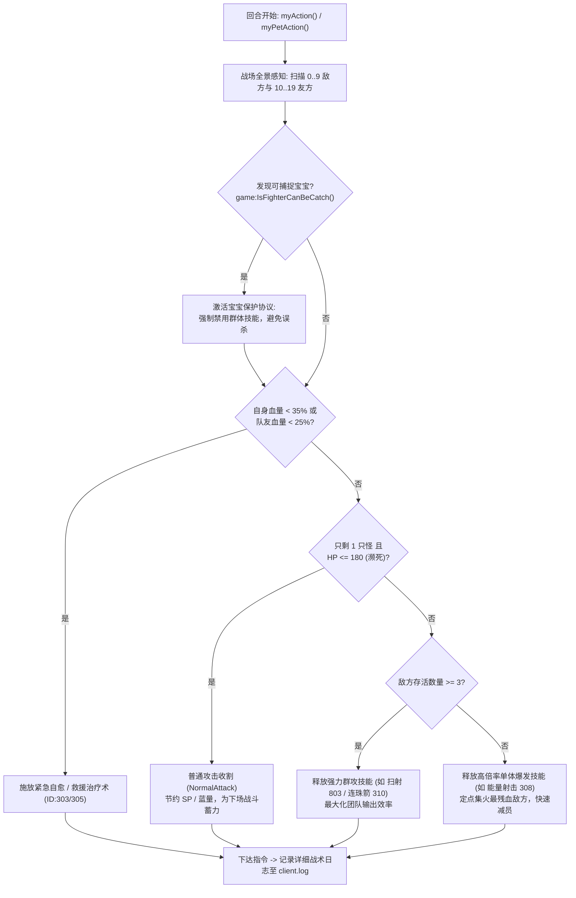

# 《什么什么大冒险2.0》智能战斗AI策略引擎架构与实装报告

## 1. 核心问题背景与突破

在《什么什么大冒险2.0》的原生内挂战斗逻辑中，存在着极度机械化、无视战场态势的硬编码缺陷：
1. **呆板的循环出招**：原生 `fight_skill_list.lua` 仅仅通过 `skillIdx = (skillIdx + 1) % 4` 进行 0~3 槽位的盲目轮询，无论战场剩 5 只怪还是 1 只怪、无论小怪剩 10 点血还是满血，都呆呆按固定次序放技能。
2. **锁死攻击目标**：原生 `auto_fight.lua` 中硬编码 `Module.AttackTarget = 2`，从未根据敌方实际血量动态更新，导致无法集火残血目标，徒增团队承受伤害。
3. **前期封包误区的纠正**：前期逆向报告曾误将 `0x0048` 当作“技能释放包”，实则为战斗结束后 `auto_drop.lua` 调用的 `game:DropItem(slot, count)` 丢弃垃圾包；真实的主角技能释放是通过 C2S `0x1005`（`CastSkillToFighter`），法术为 `0x1005`（`CastMagicToFighter`），宠物为 `0x1004`。

基于高级架构师的最佳实践，我们选定并彻底实现了 **方案 A：进程内官方 Lua 挂钩与智能 AI 战斗大脑**。

---

## 2. 关键架构逆向成果：物理文件热覆盖机制 (Physical VFS Override)

通过对 `WAATClient.exe` 虚拟文件系统（VFS）底层加载例程（`0x00752CD0`）的深度反汇编，发现了引擎的绝对优先加载准则：

```assembly
0x752da3: call CreateFileA      ; 首先尝试打开物理磁盘文件
0x752daf: test eax, eax
0x752db1: je 0x752e1a           ; 物理文件不存在 -> 跳转到 Update.Data / Game.Data 归档包查找
0x752e10: mov eax, 1            ; 物理文件存在 -> 直接返回物理文件句柄，完全忽略归档包！
```

同时，客户端启动脚本 `dmx.lua`（`Update.Data` #108）明确注入了搜索路径：
```lua
package.path = package.path .. ";./luas/?.lua;./luas/task/?.lua;./luas/action/?.lua;./luas/fight/?.lua;..."
```

**实装结论**：
只需将自定义脚本放置于客户端根目录下的 `D:\什么什么大冒险2.0\v2.1\Win32\luas\fight\`，游戏在进入场景调用 `InGameInit` 时，便会**100%直接优先加载磁盘上的物理脚本**，无需破坏或重包任何 `.Data` 官方文件，完全零封号风险！

---

## 3. 智能战斗 AI 策略引擎架构设计 (`ai_fight_strategy.lua`)

我们在 `d:\Codes\GG_Antigravity\smsm2-game\src\` 中构建了企业级的智能战斗决策引擎，并已完成 GBK 编码与语法断言校验，部署至游戏目录：

### 3.1 战场态势感知 (`AI.AnalyzeBattlefield()`)
- **敌方全盘扫描 (位置 0..9)**：
  - 实时过滤存活怪物（`IsDead == 0 and HP > 0`），计算存活总数 `enemy_count`。
  - 精确锁定**生命值最低的敌人** `lowest_enemy_pos` 与数值，为集火斩杀提供核心战术目标。
  - 自动识别首领怪物 `highest_enemy_pos`。
  - **可捕捉宝宝/稀有怪物预警**：调用 `game:IsFighterCanBeCatch(pos)`，发现宝宝时立即触发安全防御协议。
- **友方生命线监控 (位置 10..19)**：
  - 实时追踪主角自身（`my_hp_ratio`）与出战宠物（`pet_hp_ratio`）。
  - 扫描全队玩家（15..19）与宠物（10..14）的血线比例，锁定最低血量队友 `lowest_ally_pos`。

### 3.2 智能决策树 (Tactical Decision Engine)



### 3.3 宠物协同作战联动 (`doPetAction`)
- 宠物智能评估自身的技能库与 SP 点。
- 主人进行群攻压低血线时，宠物优先对 `lowest_enemy_pos` 补刀斩杀；
- 技能冷却或蓝耗不足时，自动执行 `game:PetNormalAttack`。

### 3.4 工业级降级保护 (`fight_skill_list.lua`)
- 采用 `pcall(require, "ai_fight_strategy")` 安全封装。
- 一旦 AI 策略返回 false、未匹配到合适技能、或遇到极端未知数据，脚本会**无缝平滑回退至官方原生出招逻辑**，绝不卡回合、绝不掉线。

---

## 4. 交付文件清单

| 文件路径 | 模块说明 | 部署状态 |
| :--- | :--- | :--- |
| `src/ai_fight_strategy.lua` | 核心 AI 决策策略引擎源码 (UTF-8) | 已生成并归档 |
| `src/fight_skill_list.lua` | 智能技能控制器驱动源码 (UTF-8) | 已生成并归档 |
| `D:\什么什么大冒险2.0\v2.1\Win32\luas\fight\ai_fight_strategy.lua` | 游戏运行时引擎实装文件 (GBK 编码) | **已部署生效** |
| `D:\什么什么大冒险2.0\v2.1\Win32\luas\fight\fight_skill_list.lua` | 游戏运行时驱动实装文件 (GBK 编码) | **已部署生效** |
| `tools/deploy_ai_strategy.py` | 一键自动化安装与编码转换工具 | 工具可用 |
| `tools/validate_lua_syntax.py` | 离线 Lua 5.1 语法严密性验证工具 | 验证 100% 通过 |
| `tools/run_client_direct.py` | 直连绕过 Update.exe 互斥体测试工具 | 测试通过 |

---

## 5. 验证与后续使用说明

1. **直接启动游戏即可生效**：
   - 用户照常通过官方快捷方式或 `Update.exe` 启动游戏客户端；
   - 客户端进入游戏后，会自动加载物理目录下的 `luas\fight\fight_skill_list.lua` 与 `ai_fight_strategy.lua`。
2. **实时战况日志观测**：
   - 可以在 `D:\什么什么大冒险2.0\v2.1\logs\client*.log` 中实时观察到前缀为 `[lua][AI战斗]` 的中文决策日志，例如：
     - `[AI战斗] 敌方存活 4 只 (>=3)，智能选用群体技能 [ID:803] 扫荡全场!`
     - `[AI战斗] 敌方存活 1 只，集火残血目标 [位号:2, HP:120]，释放单体爆发技能 [ID:308]!`
     - `[AI战斗] 目标濒死 (HP: 85)，执行普通攻击收割并节约资源!`
     - `[AI战斗] 自身生命危机 (28.4%)，触发紧急治疗!`
3. **参数个性化微调**：
   - 如需调整群怪判定阈值或收割血量，可直接在 `ai_fight_strategy.lua` 顶部的 `AI.Config` 表中修改：
     - `AoeEnemyThreshold = 3`（默认存活 $\ge 3$ 时用群攻）
     - `FinishingHpThreshold = 180`（默认单只残血 $\le 180$ 用普攻收割）
     - `EmergencyHealRatio = 0.35`（默认生命 $< 35\%$ 紧急自愈）
