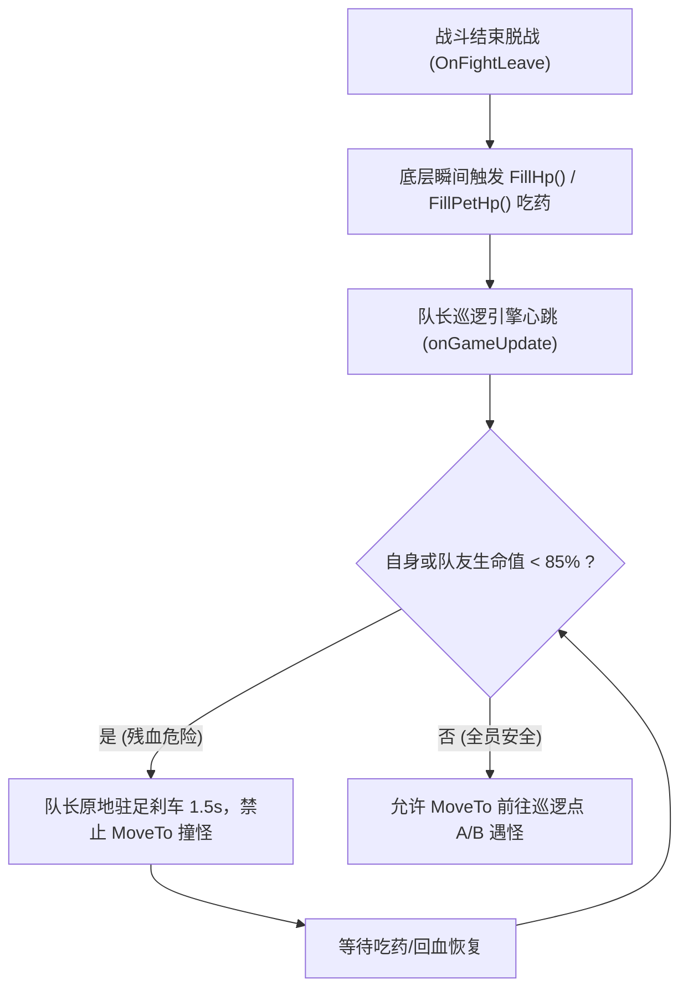

# SM2_Game — AI 战斗策略与挂机协同系统交接指南 (Combat AI & Team Coordination Manual)

> **面向对象**：后续接手维护、优化或重构本作战斗 AI 的 AI Agent（如 Claude, GPT, Gemini, Cursor 等）。  
> **核心使命**：详尽阐明《什么什么大冒险2.0》多智能体协同战斗系统的代码实现、战术黑板数据、使用场景与角色组合画像，确保接手 Agent 能在不破坏挂机稳定性的前提下无缝开展工作。

---

## 目录
1. [系统业务背景与终极目标](#1-系统业务背景与终极目标)
2. [适用组合与阵容画像 (Team Lineup Archetype)](#2-适用组合与阵容画像-team-lineup-archetype)
3. [两大核心机制与绝对铁律 (Core Invariants)](#3-两大核心机制与绝对铁律-core-invariants)
4. [核心代码模块与文件清单 (File Map)](#4-核心代码模块与文件清单-file-map)
5. [战术黑板与跨进程协同协议 (Team Blackboard Data)](#5-战术黑板与跨进程协同协议-team-blackboard-data)
6. [战外巡逻与生命安全哨兵机制 (`map_patrol.lua`)](#6-战外巡逻与生命安全哨兵机制-map_patrollua)
7. [代码热更发布流程与操作规范 (`sync.ps1`)](#7-代码热更发布流程与操作规范-syncps1)
8. [核心技能与法术 ID 字典 (Skill & Magic Reference)](#8-核心技能与法术-id-字典-skill--magic-reference)
9. [历史致命踩坑复盘与 Agent 维护禁忌](#9-历史致命踩坑复盘与-agent-维护禁忌)

---

## 1. 系统业务背景与终极目标

本项目是为 32 位（x86）Windows MMORPG 经典网游《什么什么大冒险2.0》打造的 **多客户端协同自动化挂机与战斗系统**。

### 挂机核心诉求与死穴
* **核心目标**：实现 5 个账号组成队伍，在高级地图（如 Map 264 监狱高阶怪物区）连续稳定挂机 **5 ~ 6 小时以上**，达到经验收益最大化。
* **致命痛点（团灭与回城机制）**：
  游戏的回合制机制规定：**如果在战斗结束（全场怪物死亡）的一瞬间，队伍中有任何一个玩家角色处于死亡倒地状态（HP <= 0），该角色不会在战后复活，而是会被系统强制传送回新手村（Map 20）！**
  一旦小号被传送回新手村，队伍人数减员，挂机循环彻底瓦解。
* **解法总结**：无论战斗如何惨烈，**绝不允许任何小号在死亡状态下迎来战斗结算！** 只要有人倒地，必须百分之百在战内拉起复活，才能结束战斗。

---

## 2. 适用组合与阵容画像 (Team Lineup Archetype)

本套战斗 AI 专门为 **【3大号主力输出 + 2小号专职守护 + 5出战宠物】**（共计 10 成员）的经典“3带2”挂机升级组合量身定制。

### 角色阵型与位号分配表

| 角色类型 | 位号 (Pos) | 角色名 | 职业 / 门派 | 等级 | 核心技能 / 职责 |
|---|:---:|---|---|:---:|---|
| **队长主力** | **17** | **伏地魔1** | 浪客 / 猎人 | Lv 70 | 扫射(803 Lv6)、精准射击(309 Lv12)。**全队地图巡逻遇怪唯一领航员** |
| **主力输出** | **15** | **伏地魔2** | 浪客 / 猎人 | Lv 70 | 扫射(803 Lv6)。群体超高物理爆发清场 |
| **主力输出** | **16** | **伏地魔3** | 浪客 / 猎人 | Lv 70 | 扫射(803 Lv5)。群体超高物理爆发清场 |
| **保姆小号** | **18** | **自由四号** | 学者 / 医仙 | Lv 50 | **复活术(306)**、强愈术(304)、群疗(305)。**专职储备 SP，秒拉队友** |
| **保姆小号** | **19** | **自由五号** | 学者 / 医仙 | Lv 50 | **复活术(306)**、强愈术(304)、群疗(305)。**专职储备 SP，秒拉队友** |
| **主力战宠** | **10** | 魔力布老虎 | 魔法系宠物 | Lv 70 | 烈焰爆发(1504 Lv13)、烈焰(1503)。全屏火雨 AOE 压制 |
| **主力战宠** | **11** | 魔力布老虎 | 魔法系宠物 | Lv 70 | 烈焰爆发(1504 Lv13)、烈焰(1503)。全屏火雨 AOE 压制 |
| **主力战宠** | **12** | 魔力布老虎 | 魔法系宠物 | Lv 70 | 烈焰爆发(1504 Lv13)、烈焰(1503)。全屏火雨 AOE 压制 |
| **小号随宠** | **13** | 快跑葫芦娃 | 敏捷系宠物 | Lv 50 | 技能冷却/SP不足时待命，严禁普攻抢怪 |
| **小号随宠** | **14** | 快跑葫芦娃 | 敏捷系宠物 | Lv 50 | 技能冷却/SP不足时待命，严禁普攻抢怪 |

---

## 3. 两大核心机制与绝对铁律 (Core Invariants)

在 `src/ai_fight_strategy.lua` 中，代码严格运行在以下两大不可逾越的天条之下：

### 铁律一：全员紧急停火与绝对复活协议 (Emergency Ceasefire & Absolute Revival Protocol)
* **触发条件**：AI 每回合扫描己方队伍（Pos 15..19），一旦检测到任何玩家的 `HP <= 0` 或 `IsDead ~= 0`。
* **强制行为规范**：
  1. **所有出战宠物（Pos 10..14）**：**100% 绝对强制停火待命（Standby）！严禁任何形式的火雨或普攻输出！**
  2. **所有主力猎人大号（Pos 15..17）**：**100% 绝对强制停火待命（Standby）！严禁发动扫射或单体斩杀！**
  3. **全场唯一被允许行动的角色**：存活且掌握【复活术 306】的医仙小号。
  4. **施救行为**：存活医仙以最高优先级对倒地队友位号施放【306 复活术】，瞬间将队友起死回生拉起！
  5. **恢复开火前提**：只有当场上 **所有玩家均已存活（死人数量为 0）** 时，主力大号和宠物才被允许恢复扫射。

### 铁律二：小号平时“彻底躺平，死死存满 SP” (Passive SP Hoarding & Zero Aggro)
* **设计哲学**：
  为什么小号平时不放隐匿、不放群疗、不放单加？
  **实战血泪教训证明：**
  1. 放群疗会产生巨幅全屏治疗仇恨，引爆怪物的集火攻击；
  2. 开局施放隐匿或护盾会消耗掉小号仅有的 1 点 SP（蓄力点）。一旦手头变成 0 SP，小号需要 3.9 秒重新蓄力；
  3. 如果在小号 0 SP 的几秒内发生了减员猝死，存活小号由于没有 SP 无法瞬间秒拉；而场上的残血怪会被之前挂上的持续火雨/流血伤害（DOT）跳死，导致战斗在医仙攒够 SP 前提前胜利结算，倒地小号直接回城！
* **现行极简最优策略**：
  - **全员活着时，自由四号与自由五号 100% 原地战术待命（Standby）！**
  - 不放隐匿、不放群疗、不放单加、不普攻。
  - **终极收益**：两小号手头 **100% 永远常驻满额 SP（1 ~ 2 点）**，仇恨值永远为 0。一旦队友被暴击猝死，存活医仙在 **第 1 毫秒 0 延迟秒甩复活术**，彻底粉碎了“残血怪跳死提前结算”的漏洞！

---

## 4. 核心代码模块与文件清单 (File Map)

```text
smsm2-game/
├── src/
│   ├── ai_fight_strategy.lua   # 战斗 AI 策略大脑 (状态自省、全员停火复活、小号存 SP)
│   ├── map_patrol.lua          # 独立地图巡逻引擎 (A-B点往返、避障寻路、生命安全哨兵)
│   └── auto_fight.lua          # 战斗主调度控制器 (解绑官方内挂死锁、回合时序感知)
├── sync.ps1                    # 核心发布工具: 全盘热更新同步脚本 (覆盖到所有运行中游戏目录)
├── team_blackboard.txt         # 跨进程分布式战术黑板 (各客户端实时意图与血量同步)
└── GameLuaRegister_API_Manual.md # 游戏底层 C++ 导出的原生 Lua API 权威字典
```

### 核心模块职责说明
1. **`src/ai_fight_strategy.lua`**：
   - 包含 `AI.IntrospectPlayerSkills` 和 `AI.IntrospectPetSkills`，0 硬编码自省当前角色的技能列表，自动过滤 Type=6 的被动技能。
   - 维护 `DecideAction` 主状态机：死人全员停火复活 $\to$ 小号极致存 SP 待命 $\to$ 宠物/大号群攻压制 $\to$ 意图锁定单点集火 $\to$ 普攻控蓝。
2. **`src/map_patrol.lua`**：
   - 彻底解耦官方 F12 挂机脚本，独立驱动队长（Pos 17 伏地魔1）在地图安全往返巡逻。
   - 接入 **【安全哨兵 (Health Guard)】**：战外检测到任何队员生命值 $< 85\%$ 时，队长原地刹车，未回满血绝不起步撞怪。
3. **`src/auto_fight.lua`**：
   - 解决了官方原生 Alt+Z 与 F12 勾选逻辑的冲突，动作重试超时设为 1.5 秒快速释放锁，消除死锁卡顿。

---

## 5. 战术黑板与跨进程协同协议 (Team Blackboard Data)

由于 5 个游戏客户端是互相独立的 32 位操作系统进程（各自拥有独立的 Lua VM），它们通过共享文本文件 `team_blackboard.txt` 实现纳秒级的战术意图协同。

### 协议行记录格式
```text
<Timestamp_Sec>,<Record_Type>,<Target_Pos>,<Value>,<Source_Pos>
```

### 记录类型 (Record_Type) 清单

| 记录类型 | 含义 | 字段示例 | 作用 |
|---|---|---|---|
| **`DMG`** | 预定伤害登记 (Anti-Overkill) | `1791035910,DMG,3,400,15` | 位号 15 对敌方 3 号怪预定 400 伤害，后续大号自动转移火力，杜绝伤害溢出 |
| **`HEAL`** | 单体急救令牌申领 | `1791035912,HEAL,-1,0,18` | 医仙 18 号认领急救，另一位医仙不重复过量治疗 |
| **`GROUP_HEAL`** | 群体治疗令牌申领 | `1791035915,GROUP_HEAL,-1,0,18` | 6 秒有效窗口，限制同一回合仅一名医生群疗 |
| **`REVIVE`** | 紧急复活意图登记 | `1791035920,REVIVE,19,0,18` | 18 号医仙宣告对 19 号死者施放复活术，避免双复活浪费 SP |
| **`SILENCED`** | 角色身受【封魔】状态 | `1791035922,SILENCED,-1,0,19` | 宣告自身无法施法，提示队友接管医疗职能 |

---

## 6. 战外巡逻与生命安全哨兵机制 (`map_patrol.lua`)

为防止角色在战斗中被打残脱战后，带着残血裸奔进入下一场战斗被秒杀，巡逻引擎实装了双重战外自愈机制：



---

## 7. 代码热更发布流程与操作规范 (`sync.ps1`)

> [!IMPORTANT]
> **绝对准则**：在开发工作区 `d:\Codes\GG_Antigravity\smsm2-game\src\` 修改 Lua 代码后，**游戏客户端不会直接感知**！必须运行同步脚本分发至游戏真实安装路径。

### 标准发布操作命令
使用指定 PortableGit 所在目录的 PowerShell 终端执行：
```powershell
powershell -ExecutionPolicy Bypass -File d:\Codes\GG_Antigravity\smsm2-game\sync.ps1
```

### `sync.ps1` 内部做的事情
1. 自动定位宿主机 `D:\*2.0`（即 `D:\什么什么大冒险2.0`）安装根目录；
2. 循环将 `src/ai_fight_strategy.lua` 覆盖至：
   - `D:\什么什么大冒险2.0\luas\ai_fight_strategy.lua`
   - `D:\什么什么大冒险2.0\luas\fight\ai_fight_strategy.lua`
   - `D:\什么什么大冒险2.0\v2.1\luas\ai_fight_strategy.lua`
   - `D:\什么什么大冒险2.0\v2.1\luas\fight\ai_fight_strategy.lua`
   - `D:\什么什么大冒险2.0\v2.1\Win32\luas\ai_fight_strategy.lua`
   - `D:\什么什么大冒险2.0\v2.1\Win32\luas\fight\ai_fight_strategy.lua`
3. 同步将 `src/map_patrol.lua` 覆盖至上述对应 6 处目录；
4. **游戏端生效机制**：客户端在每一场战斗开始的 `OnBeginFight` 事件中，会自动执行 `package.loaded["ai_fight_strategy"] = nil` 并重新 `require`，**实现无需重启游戏进程的无缝热重载**！

---

## 8. 核心技能与法术 ID 字典 (Skill & Magic Reference)

在阅读或编写 `ai_fight_strategy.lua` 时，严禁用错技能 ID 与类型：

### 猎人物理主动技能库 (`Type == 0`)
* **`803` - 扫射**：全屏 10 目标物理群攻（敌方存活 >= 2 时的绝对清场核心）。
* **`309` - 精准射击**：单体高额爆发（Lv12 附带 530 真实伤害，单体点杀最优解）。
* **`310` - 连珠箭**：3 目标小群攻。

### 医仙法术库 (`Type == 1`)
* **`306` - 复活术**：**救命神技（耗 1 SP）**。倒地瞬间起死回生拉起队友。
* **`305` - 群体治疗术**：全队回血（耗 1 SP）。**注意：会引发全图怪物仇恨！**
* **`304` - 强愈术**：单体超高额急救（一发爆加 900+ 气血，0 仇恨）。
* **`313` - 急救术**：单体高额急救（一发回血 700+ 气血）。
* **`212` - 隐匿**：自身隐身规避集火。

### 宠物魔法能力库 (`Type == 1`)
* **`1504` - 烈焰爆发**：宠物全屏火系魔法群攻（魔力布老虎核心大招）。
* **`1503` - 烈焰** / **`1502` - 烈火**：低阶群攻/单攻。

---

## 9. 历史致命踩坑复盘与 Agent 维护禁忌

接手的 AI Agent 在未来进行任何优化或重构时，**必须牢记以下三条铁律，违者必导致小号回城或挂机崩溃**：

1. **绝对不要在全员健康时让两小号施放任何主动技能！**
   - 曾有版本让小号放隐匿或群疗，导致小号开局 SP 归零（SP=0）。当其中一个小号被怪猝死秒杀时，另一个存活小号手里没有 SP 无法瞬间施放复活术；等它攒 SP 的几秒里，怪物被持续灼烧跳死，直接战斗结算回城！
   - **请坚守“小号平时彻底待命存 SP”的极简真理！**
2. **绝对不要打破“死人全员停火”天条！**
   - 绝不能给大号加上任何“只剩一只怪赶紧秒掉脱战”的偷鸡逻辑。只要有玩家处于倒地状态，必须死死按住所有人的手，保留场上怪物作为战局载体，直到医仙成功把人拉起！
3. **永远使用 PortableGit 与指定代理端口 7897 提交代码！**
   - 宿主系统没有将 Git 加入环境变量，且本地代理为 Clash Verge 7897 端口。调用外部工具时遵循环境规则，防止进程挂起。
