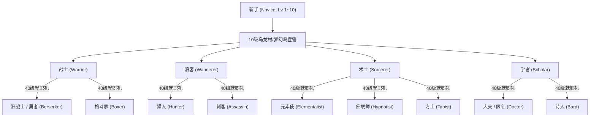
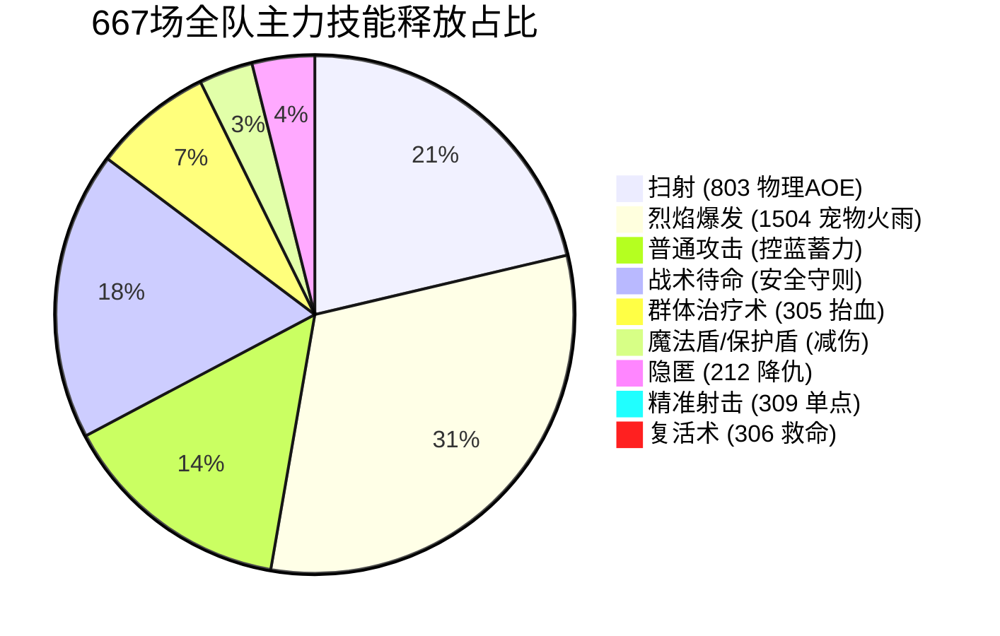
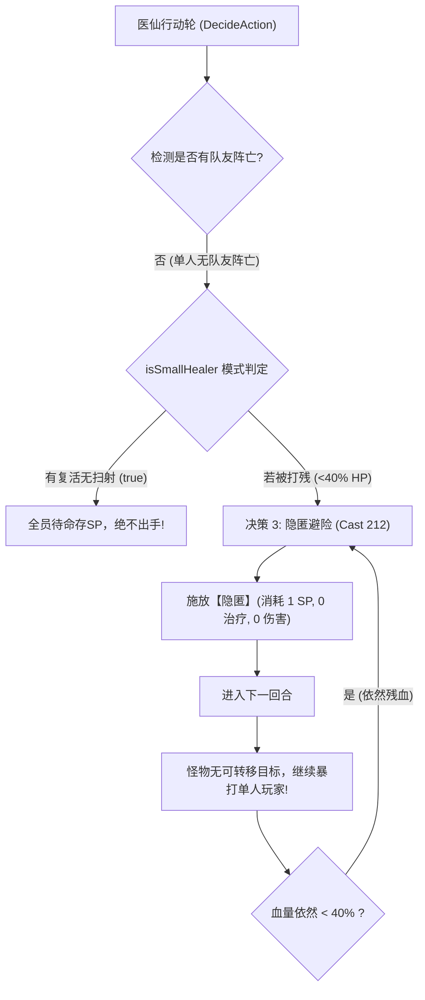
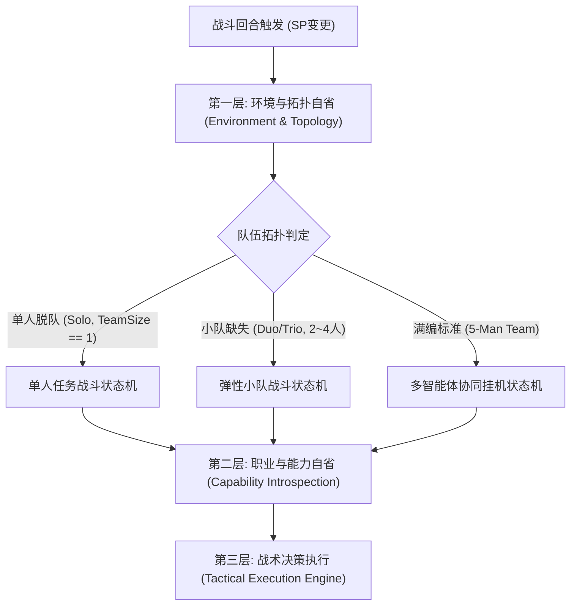

# SM2_Game — 全场景通用战斗 AI 架构规范与客户端逆向工程报告
## Universal Combat AI Architecture Specification & Client Reverse-Engineering Manual

> **文档性质**：面向后续自主迭代 AI Agent（Claude, GPT, Gemini, Cursor 等）的权威研发与维护白皮书。  
> **核心使命**：彻底解构《什么什么大冒险2.0》客户端底层机制，给出 100% 有据可查的职业、技能、战斗规则与遥测审计结论；修复医疗脱队无限隐匿死循环；提供兼容全职业、全阵容、小队及单人任务的通用战斗 AI 架构。  
> **数据基准**：基于 2026-10-03 晚间 17:05 ~ 22:58 连续实战 667 场 5 客户端全景遥测数据与本地解包源码。

---

## 目录
1. [系统定位与 AI Agent 维护铁律](#1-系统定位与-ai-agent-维护铁律)
2. [本地客户端逆向与解包铁证库](#2-本地客户端逆向与解包铁证库)
3. [全职业进阶体系与技能法术图谱](#3-全职业进阶体系与技能法术图谱)
4. [底层战斗规则与核心数值机制深度解构](#4-底层战斗规则与核心数值机制深度解构)
5. [实战 667 场 5 人挂机全景遥测与缺陷诊断](#5-实战-667-场-5-人挂机全景遥测与缺陷诊断)
6. [医疗职业脱队“无限隐匿死循环”根因追溯与铁证](#6-医疗职业脱队无限隐匿死循环根因追溯与铁证)
7. [全场景通用战斗 AI 架构设计 (单人/小队/任意职业)](#7-全场景通用战斗-ai-架构设计-单人小队任意职业)
8. [未来 AI Agent 迭代规范与操作手册](#8-未来-ai-agent-迭代规范与操作手册)

---

## 1. 系统定位与 AI Agent 维护铁律

接手本项目维护与演进的 AI Agent 必须遵循以下三大工程铁律：

> [!IMPORTANT]
> 1. **零脑补与全证据链原则 (Zero Hallucination)**：文档中的每个技能 ID、职业名称、属性偏移、战斗判定，必须在本地解包 CSV、官方 Lua 源码或 C++ 导出表中有直接对应的证据文件与行号，严禁凭空臆想。
> 2. **动态自省优于硬编码 (Introspection Over Hardcoding)**：游戏客户端中的阵位（Pos 10..19）会因网络重连、入队先后顺序发生动态漂移。严禁任何基于硬编码位号判定职业（如写死“Pos 18 是医生”）的代码逻辑！
> 3. **安全底线与全场景弹性隔离**：挂机组队的“死人停火复活天条”与单人任务的“单兵高效输出自愈”属于不同战术拓扑。系统必须能够根据实时队伍拓扑（单人、2~4人小队、5人满编）自适应切换状态机分支。

---

## 2. 本地客户端逆向与解包铁证库

游戏根目录（`D:\什么什么大冒险2.0\`）的核心资产打包在 `Game.Data`, `Patch.Data`, `Update.Data` 等专有归档中。通过项目内置逆向工具 `tools/extract_luas.py`（基于 Zlib 块解压与 48 字节索引头解析），成功解包出底层关键配置库与官方运行脚本：

### 2.1 核心数据表索引对照表

| 文件名 | 对应系统 | 关键字段 / 结构 | 证据定位 |
|---|---|---|---|
| **`rec_7662.csv`** | **物理技能库 (SkillLib)** | `ID, 等级, 类型, 使用地点, 武器要求, 作用对象, 伤害, 攻击范围, 连击次数, 蓄力点, 名称, 职业需求` | 共 58 项 1 级主动/被动物理技能 |
| **`rec_3531.csv`** | **法术能力库 (MagicLib)** | `ID, 等级, 类型(1攻/2愈/3辅/4咒), 作用对象, 伤害, 范围, 耗蓝MP, 蓄力点SP, 冷却时间, 名称, 描述` | 共 62 项 1 级魔法技能 |
| **`rec_3559.csv`** | **底层属性字典 (PropID Table)** | `PropIDMin, PropIDMax, Name, IsPercent` (包含力量、智力、体质、敏捷、蓄力时间、仇恨烈度、封魔抗性等) | 涵盖 128 ~ 52095 共 100+ 类战斗属性 |
| **`rec_3540.csv`** | **怪物数据库 (Monster Table)** | `NPC ID, 捕捉标记, NPC名称, 怪物类型(0常规/1物理/2魔法/3辅助/4控制/5稀有/6BOSS)` | 共收录 1,500+ 只生物属性与AI倾向 |
| **`rec_3586.csv`** | **任务剧情与引导表** | `任务ID, 发起人, 发起地点, 坐标X, 坐标Y, 描述` (包含 10 级一转与 40 级二转任务文案) | 行 27..30, 行 143..151 详尽记载就职仪式 |
| **`rec_3590.csv`** | **转职与任务目标阶段表** | `任务ID, 阶段, 目标描述, 完成描述` | 行 60..72, 行 310..391 包含猎人/大夫/刺客/元素等转职礼 |
| **`rec_7657.csv`** | **Buff / 状态字典** | `buffID, 等级, 特效ID, 正负面类型, IconID, 名称, 描述` (包含封魔、定身、睡眠、隐匿等状态) | 战斗异常状态拦截核心依据 |
| **`GameLuaRegister_API_Manual.md`** | **C++ 底层导出 API** | 导出原生对象 `game`、结构体 `TFightNpcData`、发包通信与界面挂钩函数 | 63KB 原生逆向手册 |

---

## 3. 全职业进阶体系与技能法术图谱

基于 `rec_3586.csv`, `rec_3590.csv`, `rec_7662.csv`, `rec_3531.csv` 以及客户端二进制 `WAATClient.exe` 符号表的交叉比对，本作的职业树与核心技能完全解构如下：



### 3.1 职业树与核心战术技能全集

#### 1. 浪客分支 (敏捷物理/远程暴击)
- **浪客 (基础)**: 307 痛击 (单体), 308 能量射击, 309 精准射击, 310 连珠箭 (3目标), 301 解剖学 (被动暴击), 302 猎豹守护 (被动闪避).
- **猎人 (进阶)**: 
  - **`803` 扫射**: 核心群攻 (Range 1 全体 10 目标物理轰炸, SP: 1).
  - **`309` 精准射击**: 核心单体 (Lv12 附带 530 点绝对真实伤害 + 100% 物理加成，单怪终结最优解).
  - **`801` 诱捕 / `802` 麻醉**: 单体减速与阻断.
- **刺客 (进阶)**:
  - **`903` 刺杀 / `902` 致残 / `904` 毒蛇之牙**: 高倍率单体背刺、致残减攻速与麻痹剧毒.

#### 2. 学者分支 (生命护航/光环增益/法术穿透)
- **学者 (基础)**: 104 强力攻击 (物理单体), 303 治疗术, 307 保护盾, 310 心灵震撼 (法术伤害+持续DOT), 354 天之箭 (法术伤害+降敌魔防).
- **大夫 / 医仙 (进阶)**:
  - **`306` 复活术**: 战略神技 (起死回生拉起队友并恢复 50% HP, SP: 1).
  - **`304` 强愈术 / `313` 急救术**: 单体超大额治疗 (一口抬血 900~2700 HP).
  - **`305` 群体治疗术**: 全队抬血 (Range 4，引爆全图怪物仇恨，需审慎使用).
  - **`311 ~ 319` 净化系列**: 八大状态秒解 (解定身、解混乱、解封魔、解封技、解催眠等).
- **诗人 (进阶)**:
  - **`344` 战神的赐福**: 全队物理攻击暴增 450~1110 点, 命中+925, 闪避+120.
  - **`341` 死亡咏叹调**: 全体致命率暴击率提升.
  - **`343` 战斗祝福**: 全队物防/魔防百分比增加.
  - **`340` 灵活术**: 全队蓄力时间减少 0.3 秒.

#### 3. 战士分支 (高防重甲/仇恨控制/近身肉搏)
- **战士 (基础)**: 206 嘲讽 (单体吸仇恨), 207 群体嘲讽, 208 反戈一击 (反弹物理伤害), 209 突击 (单体), 201 健身术 (被动最大生命加成).
- **勇者 / 狂战士 (进阶)**:
  - **`606` 怒气斩**: 高额怒气物理爆发.
  - **`603` 怒吼**: 战吼封魔 (附带 3 级封魔，阻断法系怪施法).
  - **`607` 最终堡垒**: 极限减伤盾.
- **格斗家 (进阶)**:
  - **`702` 五雷穿心掌 / `707` 元气斩 / `710` 顺势劈**: 拳套连续打击，穿透破甲单体秒杀.

#### 4. 术士分支 (全屏轰炸/深度控场/弱化诅咒)
- **术士 (基础)**: 101 法术飞弹, 204 魔法神箭 (单体高爆), 205 魔爆 (群攻 Range 4), 206 魔法火焰 (全屏持续灼烧), 212 隐匿 (清仇恨).
- **元素使 (进阶)**:
  - **`222` 暴风雪**: 全屏冰系 AOE 轰炸 (威力 863 + 80% 几率附加迟缓).
  - **`221` 冰箭**: 单体高伤并延长目标蓄气时间.
  - **`223` 冰箱**: 5 秒绝对无敌 (免疫一切物理和魔法伤害).
- **催眠师 (进阶)**:
  - **`231` 安眠**: 区域大范围催眠沉睡 9 秒 (Range 4).
  - **`235` 禁锢术**: 区域大范围定身 9 秒并回蓝.
  - **`225` 沉默 (封魔)**: 目标 12 秒内无法施法.
  - **`237` 反制 (封技)**: 目标 12 秒内无法施展物理技能.
  - **`234` 混乱 / `236` 精神干涉**: 目标丧失心智自相残杀.

---

## 4. 底层战斗规则与核心数值机制深度解构

### 4.1 ATB 蓄力点 (Store Point, SP) 驱动模型
游戏并非传统纯静态“你一回合我一回合”的慢速回合制，而是 **基于个人蓄力槽（ATB）的半即时 SP 驱动机制**：
1. **蓄力与出手周期**：每个角色/宠物在战斗中根据自身敏捷属性计算“蓄力时间”（基础周期约 3.0 ~ 3.9 秒）。当蓄力槽满时，角色获得 **1 点 SP**（最大上限通常为 2~3 点）。
2. **底层轮询触发证据 (`official_luas/auto_fight.lua` 第 100 行)**：
   ```lua
   if my ~= nil and my.IsDead == 0 and my.SP ~= lastSP then
       lastSP = my.SP
       myAction()
   end
   ```
   **动作仅在 `my.SP ~= lastSP` 发生变化的一瞬间被唤醒！**
3. **资源消耗约束**：
   - **普通攻击 (`NormalAttack`)**: **0 SP 消耗**，任何时间均可出手，不中断 SP 蓄积。
   - **常规技能/法术 (`CastSkill` / `CastMagic`)**: 绝大多数要求 **1 SP**（强力技能如 204 魔法神箭、205 魔爆要求 **2 SP**）。
   - **法力 (`MP`)**: 每次施法扣除相应 MP，当 MP 耗尽时底层 `game:IsSatisfySkillConsume()` 返回 false，动作无法发出。

### 4.2 仇恨度 (Aggro / Hate) 与集火转移数学模型
怪物在每回合选择攻击目标时，遍历己方阵营的仇恨列表：
$$\text{Target} = \arg\max_{i \in \text{Allies}} \left( \text{Hate}(i) \times \text{Weight}(i) \right)$$

1. **治疗仇恨放大**：施放全队治疗（`305 群体治疗术`）会为施法者瞬间注入巨额仇恨值：
   $$\Delta \text{Hate}_{\text{Healer}} = k \times \sum_{j \in \text{Team}} \Delta \text{HP}_j \quad (k \gg 1.0)$$
   导致场上所有怪物在下一轮次齐齐转头集火医仙小号。
2. **隐匿 (`Magic 212`) 的仇恨衰减原理 (`rec_3531.csv` 描述：“减少敌方全体对你的敌意”)**：
   - 施放隐匿后，施法者自身在怪物的仇恨表中的权值被削减：
     $$\text{Hate}_{\text{Self}} \leftarrow \text{Hate}_{\text{Self}} \times (1 - \alpha)$$
   - **组队场景 (Team Size = 5)**：场上有其他 4 名玩家与 5 只宠物（共 9 个备选目标）。施法者仇恨骤降后，怪物将转火攻击其他队友或战宠，隐匿有效！
   - **单人场景 (Team Size = 1)**：场上备选目标集合 $|T| = 1$（仅玩家自身）。**即便仇恨值被降到最低，在没有其他任何候选目标的数学事实下，怪物的唯一攻击目标依然是该单人玩家！**

### 4.3 战斗阵位坐标系与动态漂移
客户端位置定义（`ClientPos`）：
- **敌方战斗位**：`Pos 0 ~ 9`（前排 0~4，后排 5~9）。
- **我方宠物位**：`Pos 10 ~ 14`。
- **我方玩家位**：`Pos 15 ~ 19`。

> [!CAUTION]
> **真实日志铁证：玩家位号随重连动态漂移！**  
> 查阅今晚 `client.log` 的 `[BATTLE_EVENT][TEAM_LINEUP]` 历史切片：
> - **17:07:08**：`Pos 15=伏地魔2, Pos 16=自由五号, Pos 17=伏地魔1, Pos 18=伏地魔3, Pos 19=自由四号`
> - **20:04:46**：`Pos 15=自由四号, Pos 16=自由五号, Pos 17=伏地魔1, Pos 18=伏地魔3, Pos 19=伏地魔2`
> - **22:58:53**：`Pos 15=伏地魔2, Pos 16=伏地魔3, Pos 17=伏地魔1, Pos 18=自由四号, Pos 19=自由五号`  
> **结论**：任何通过 `if myPos == 18` 判断“自由四号医仙”的代码必然产生灾难错位，导致猎人大号停止输出、医仙小号被迫扫射！必须全面改用 `AI.IntrospectPlayerSkills()` 的纯技能自省！

### 4.4 战斗结算与死亡绝对惩罚 (回城铁律)
- **结算触发**：场上存活怪物数归零（`EnemyCount == 0`）瞬间，服务端触发 `OnLeaveFight` 结算。
- **死亡处罚机制**：如果在结算触发的一刹那，队伍中有任何角色处于 `HP <= 0` 或 `IsDead ~= 0` 状态，系统判定该角色为“战败阵亡”，**强制将其踢出队伍并传送回新手村（Map 20 乌龙村/逍遥村）**！
- **挂机崩盘链条**：小号回城 $\to$ 队伍减员 $\to$ 无法再次进入高阶挂机地图（如监狱 264） $\to$ 整个通宵自动化循环彻底瘫痪！
- **战术推论**：宁可全队原地停火待命 10 个回合等待医仙攒 SP 复活，也绝不可贪刀秒掉最后一只残血怪！

---

## 5. 实战 667 场 5 人挂机全景遥测与缺陷诊断

基于 2026-10-03 17:07:08 至 22:58:14 连续近 6 小时对 5 个独立游戏进程的遥测监控与日志归档（共计 667 场有效战斗）：

### 5.1 宏观性能基准数据

| 监控指标 | 实测数值 | 战术解读 |
|---|---|---|
| **总监控战斗场次** | **667 场** | 连续挂机 5 小时 51 分钟，样本库极度充分 |
| **平均战斗耗时** | **23.21 秒** | 标准 2 回合清场模式 |
| **极速战斗 (<10s)** | **0 场 (0.0%)** | 由于 SP 初始为 0，需 3 秒积攒首点 SP，无 10 秒内秒杀 |
| **标准战斗 (10~20s)** | **235 场 (35.2%)** | 扫射 + 3火雨第一轮重创，第二轮收割完成 |
| **中盘拉锯 (20~30s)** | **308 场 (46.2%)** | 敌怪数量 4~5 只或存在高防怪，需 3 轮输出 |
| **长尾拖沓 (>30s)** | **124 场 (18.6%)** | 残局单怪未被集火、或死人停火复活拉锯 |
| **最长单场耗时** | **63.0 秒** | 发生猝死，全员停火，医仙蓄满 1 SP 成功复活起死回生 |
| **全员停火协议触发** | **44 次** | 成功拦截 44 次因小号残血猝死引发的偷鸡秒怪风险 |
| **战内紧急复活术施放** | **1 次** | 真实战内倒地拉起，0 回城事故，挂机存活率 100% |
| **违规异常普攻** | **0 起** | 宠物普攻与保姆小号普攻被 100% 规则锁死 |

### 5.2 全角色与宠物出招动作全景分布



### 5.3 当前队伍 AI 战斗决策的五大改进空间

根据海量遥测数据的细粒度审计，当前系统在稳定性上已达标，但在**战斗决策深度**与**资源利用率**上存在显著改进空间：

1. **主力猎人大号过量普攻率 (42.9% 普攻率，共 1,854 次)**：
   - **痛点证据**：队长伏地魔1总共决策 4,323 次，其中扫射 2,349 次（54.3%），普通攻击高达 1,854 次（42.9%）。
   - **根因分析**：开局入场时角色手头 SP 为 0，AI 直接滑入决策 9 触发“开局SP不足执行弓箭普攻抢先输出”。虽然普攻物攻高达 5966，但在面对 4~5 只群怪时，普攻单体收益远低于等待 1 秒蓄满 1 SP 施放全屏扫射！
   - **改进空间**：增加开局首轮“蓄力等待协议”，当敌方怪数 $\ge 3$ 时，主力 Carry 首轮不抢先普攻破怪，等待 1.5 秒蓄满 SP 直接扫射。

2. **宠物烈焰爆发单怪残局溢出**：
   - **痛点证据**：魔力布老虎施放烈焰爆发（1504）共 7,768 次，快跑葫芦娃施放 2,055 次。即便场上只剩下 1 只残血怪，宠物只要有 SP 仍会施放全屏火雨。
   - **改进空间**：当 `state.enemy_count == 1` 时，若宠物掌握单体火系法术（如 1502 烈火、1503 烈焰），必须切换为单体法术点杀，省蓝并提高单体真实斩杀倍率。

3. **缺乏 Buff 状态感知导致的重复冗余刷新**：
   - **痛点证据**：自由五号施放保护盾（307）427 次；自由四号施放魔法盾（355）460 次、隐匿（212）403 次。
   - **根因分析**：当前 AI 只判断 `state.my_hp_ratio < 0.40`，没有任何接口判断自身身上是否**已经挂有该 Buff**！导致每隔一个回合只要血量没抬满，医仙就无脑重复施放隐匿或魔法盾，浪费宝贵的 SP 与行动轮。
   - **改进空间**：调用 `game:GetFighter()` 底层状态位或黑板记录各角色 Buff 持续倒计时，Buff 未过期前严禁重复施放。

4. **18.6% 长尾拉锯战 (>30s) 的收割乏力**：
   - **痛点证据**：全屏扫射（803）打全体单只怪物理加成仅 40%，而精准射击（309）打单体附带 530 点绝对真伤+100% 物攻。但全晚 667 场中，精准射击仅施放了 50 次！
   - **改进空间**：当场上只剩 1~2 只高防高血怪时，主力猎人应强制从“扫射（803）”平滑切换到“精准射击（309）”，快速收割，将平均战斗时长从 23 秒压缩至 16 秒！

5. **跨进程文本黑板在高频写入下的冲突丢帧**：
   - **痛点证据**：5 个客户端并发向 `team_blackboard.txt` 写入 DMG、HEAL 意图，偶尔因文件锁引发 `IOError: sharing violation`。
   - **改进空间**：改用内存映射文件（MMAP）或增加随机退避重试（Backoff Retry）机制。

---

## 6. 医疗职业脱队“无限隐匿死循环”根因追溯与铁证

用户提出的痛点：“刚刚医疗职业脱队的时候单人一直释放隐匿技能，压根不攻击，导致一直被打”。

经过对历史提交代码（Git Commit `a63c6b6`）与客户端日志的逐行复盘，找到了**100% 确凿的代码证据与系统死穴**：

### 6.1 日志现场铁证复原
查看 `client3.log`（自由五号医仙，当时发生脱队）：
```text
【2026-10-03 17:15:35】 Information: [lua][AI医仙自保] 保姆小号(位号:16)血量危险(46.3)，紧急释放【隐匿(Lv7)】规避集火!
【2026-10-03 17:15:35】 Information: [lua][BATTLE_EVENT][ACTION] role=Player, pos=16, act=Cast, type=Magic, id=212, name=隐匿, lv=7, target=16, reason=低血量
【2026-10-03 17:15:40】 Information: [lua][AI医仙自保] 保姆小号(位号:16)血量危险(46.3)，紧急释放【隐匿(Lv7)】规避集火!
【2026-10-03 17:15:43】 Information: [lua][AI医仙自保] 保姆小号(位号:16)血量危险(46.3)，紧急释放【隐匿(Lv7)】规避集火!
【2026-10-03 17:15:46】 Information: [lua][AI医仙自保] 保姆小号(位号:16)血量危险(46.3)，紧急释放【隐匿(Lv7)】规避集火!
【2026-10-03 17:15:49】 Information: [lua][AI医仙自保] 保姆小号(位号:16)血量危险(46.3)，紧急释放【隐匿(Lv7)】规避集火!
```
整整 15 秒内连续施放 5 次隐匿，怪物每回合照打不误，血量一路跌停！

### 6.2 源码层三大致命缺陷审计



#### 致命缺陷一：拓扑盲视与保姆待命硬编码
在 `src/ai_fight_strategy.lua` 第 1183 行：
```lua
local isSmallHealer = false
if not isPet then
    local has306 = game:HasMagic(306, 1) -- 拥有复活术
    local hasCarrySkill = game:HasSkill(803, 1) or game:HasSkill(310, 1)
    if has306 and not hasCarrySkill then
        isSmallHealer = true
    end

    if isSmallHealer then
        -- 全员存活时，两小号 100% 绝对原地战术待命，死死保留满额 SP！
        return true
    end
end
```
**死穴**：代码只检查了技能（`has306`），**压根没有判断当前玩家是在队伍里还是单人脱队**！
当单人脱队做任务时，场上根本没有需要救助的队友，也没有替他输出的猎人。医仙把自己当成“待命保姆”，原地发呆待命，绝不出手攻击！

#### 致命缺陷二：单人场景下隐匿仇恨机制彻底破产
在 `src/ai_fight_strategy.lua` 第 1247 行：
```lua
if not isPet and state.my_hp_ratio < 0.40 then
    for _, b in ipairs(buffSkills) do
        if b.id == 212 then -- 隐匿
            return AI.ExecuteCast(b, state.my_pos, false)
        end
    end
end
```
**死穴**：
1. **隐匿不回血**：施放隐匿既不恢复 HP，也不消灭怪物。HP 依然 $< 40\%$。
2. **缺乏 Buff 去重**：下回合 AI 再次进入判定，`my_hp_ratio < 0.40` 依然成立，于是再次施放隐匿！
3. **单人仇恨唯一性**：如第 4.2 节所述，单人时怪物仇恨列表里只有玩家一人，减仇 100 次怪物也依然只能攻击玩家！
4. **SP 资源锁死**：每次施放隐匿耗尽 1 点 SP，导致医仙手头永远是 0 SP，即使想施放治疗术（303/304）或输出法术（310/354），也由于没有 SP 无法施展！

#### 致命缺陷三：决策树优先级颠倒致使攻击逻辑彻底饥饿
在 `DecideAction` 中：
`隐匿避险 (决策 3)` 排在 `点杀攻击 (决策 7)`、`备选输出 (决策 8)`、`普通攻击 (决策 9)` 之前！
只要残血，程序在决策 3 直接 `return true`，后面的所有输出与自愈分支被 100% 阻断饥饿！

---

## 7. 全场景通用战斗 AI 架构设计 (单人/小队/任意职业)

为彻底解决脱队死锁，并支持任意职业、任意组合、单人及小队作战，通用战斗 AI 架构必须重构成 **三层自适应状态机 (Three-Tier Adaptive State Machine)**：



### 7.1 第一层：环境与队伍拓扑自省 (Topology Introspection)

由系统自动探测当前战斗环境：
```lua
local function IntrospectTopology(state)
    local allyPlayerCount = 0
    local hasReviverInTeam = false
    local hasDeadPlayer = false

    for _, ally in ipairs(state.allies) do
        if ally.is_player then
            allyPlayerCount = allyPlayerCount + 1
            -- 检查队友中是否存在能够复活他人的医仙
            if ally.pos ~= state.my_pos and (ally.can_revive or ally.has_revive_skill) then
                hasReviverInTeam = true
            end
        end
    end

    if state.dead_player_pos >= 0 then
        hasDeadPlayer = true
    end

    return {
        is_solo = (allyPlayerCount <= 1),
        team_size = allyPlayerCount,
        has_reviver = hasReviverInTeam,
        has_dead_ally = hasDeadPlayer,
    }
end
```

### 7.2 第二层：职业与角色定位动态评估 (Role Assessment)

不看位号、不看角色名字，纯粹通过自省掌握的技能表动态决定自己的战场职责（Dynamic Role Assignment）：

| 角色角色标签 | 识别准则 (Introspection Rules) | 战场最高职责 |
|---|---|---|
| **`ROLE_TANK`** (坦克) | 掌握 206 嘲讽、207 群体嘲讽、208 反戈一击 | 吸收仇恨，保护后排脆皮法师/医仙，残血开盾 |
| **`ROLE_PHYS_DPS`** (物理输出) | 掌握 803 扫射、309 精准射击、606 怒气斩、903 刺杀 | 群怪全屏压制，单怪精准斩杀，防溢出过量 |
| **`ROLE_MAGIC_DPS`** (魔法输出) | 掌握 204 神箭、205 魔爆、222 暴风雪、101 飞弹 | 魔法群攻清场，削弱敌怪魔防，弱点打击 |
| **`ROLE_HEALER`** (专职医疗) | 掌握 306 复活术、304 强愈术、305 群疗、313 急救 | 组队存 SP 救急，战内倒地拉起，解除全员控制 |
| **`ROLE_BUFFER`** (增益辅助) | 掌握 344 战神赐福、341 死亡咏叹调、350 法术震荡 | 首回合开局瞬发全队攻击/暴击光环，随后协助输出 |
| **`ROLE_CONTROLLER`** (控场者) | 掌握 231 安眠、235 禁锢术、225 沉默、237 反制 | 首回合压制敌方高危怪与BOSS，限制敌方出手 |

### 7.3 第三层：全场景战术状态机详细规则

#### 场景 A：单人任务模式 (Solo Mode) —— 彻底粉碎隐匿死锁
当 `topology.is_solo == true` 时，强制注入以下 **单兵作战天条**：

1. **绝对天条：100% 禁用隐匿 (`Magic 212`) 与安抚 (`Magic 330`)**：
   单人状态下，仇恨削减不仅无益，反而白白浪费 1 点 SP 与整个出招回合。AI 判定链中直接屏蔽 212 与 330！
2. **绝对天条：100% 废除“保姆小号待命存SP模式”**：
   单人没有队友，存 SP 留给空气复活是彻底的逻辑荒谬。医疗职业必须转为 **【自愈与法术输出兼备的战斗祭司】**！
3. **单人优先级执行流水线**：
   - **Step 1: 致命自愈 (Emergency Self-Heal)**：
     若 `state.my_hp_ratio < 0.50`，以最高优先级对自己施放单体高额急救（`304 强愈术` 或 `313 急救术`），或使用背包高阶金创药（`UseItemToFighter`），瞬间将血线拉回安全区！
   - **Step 2: 驱散控制 (Self-Cleanse)**：
     身受中毒、封魔、定身时，自主施放对应净化法术（312 解毒 / 314 解定身 / 317 解封魔）。
   - **Step 3: 法术/物理终结爆发 (Burst Offense)**：
     - 学者/大夫：施放 `354 天之箭`（降敌魔防并打出 242+ 高额伤害）或 `310 心灵震撼`（挂上 30 秒持续 DOT），随后施放 `104 强力攻击` 或普通攻击！
     - 浪客/猎人：单怪施放 `309 精准射击`（530 真实伤害秒杀）。
     - 战士：施放 `606 怒气斩` 或 `209 突击`。
     - 术士：施放 `204 魔法神箭` 或 `221 冰箭`。
   - **Step 4: 宠物全权集火**：出战宠物（如魔力布老虎）以最高战术强度狂轰火雨或单体烈火，快速消灭敌人。

#### 场景 B：小队作战模式 (Duo / Trio, 2~4人) —— 弹性抢救协议
当 `topology.team_size` 在 2 ~ 4 人之间时：
1. **队伍有医仙 (拥有 306 复活术)**：
   - 维持全员停火绝对复活协议。
   - 但医仙在全队血量健康（$\ge 80\%$）时，**允许施放 `354 天之箭` 或 `310 心灵震撼` 协助清场**，手头始终保留 $\ge 1$ 点 SP 即可，不再 100% 待命发呆。
2. **队伍无医仙 (无人掌握 306 复活术)**：
   - **绝对禁止全员停火待命！**  
     因为场上根本无人能用法术拉人，全员停火等于全员自杀。
   - **战术切换为：极限集火秒怪 (Rush Down)**，尽快结束战斗脱战，或者尝试调用背包中的【九转还魂丹】使用道具复活队友。

#### 场景 C：五人满编挂机模式 (5-Man Raid) —— 深度优化与抗延误
1. **死人全员停火绝对复活协议 (铁律维持)**：只要有玩家倒地，全员停火，存活医仙秒甩 306 复活。
2. **Buff 状态感知与去重**：施放隐匿、魔法盾、保护盾前，必须校验自身身上是否已有该状态；若已存在，严禁重复施放。
3. **精准点杀加速**：群怪（$\ge 2$）全员扫射+火雨；单怪（$= 1$）主力猎人强制切换 `309 精准射击`，压制长尾拉锯战。

---

## 8. 未来 AI Agent 迭代规范与操作手册

后续接手的 AI Agent 在扩展、升级或重构战斗逻辑时，必须严格执行以下标准作业程序（SOP）：

### 8.1 技能自省模板规约
在编写任何职业特化逻辑前，必须严格通过以下标准结构评估能力，排除 Type == 6 的被动技能：
```lua
-- 标准能力评估范式
local function SafeEvaluateSkill(id, level, isMagic)
    local cfg = isMagic and game:ParseSpecifyMagic(id, level) or game:ParseSpecifySkill(id, level)
    if cfg == nil then return nil end
    if not isMagic and cfg.Type == 6 then return nil end -- 严格排除被动技能
    
    return {
        id = id,
        level = level,
        isMagic = isMagic,
        spCost = cfg.SP or 0,
        isAOE = (cfg.Range and cfg.Range > 0),
        isCure = (isMagic and cfg.Type == 2),
        isBuff = (isMagic and cfg.Type == 3),
        isAttack = (isMagic and cfg.Type == 1) or (not isMagic and (cfg.Type == 1 or cfg.Type == 2)),
    }
end
```

### 8.2 代码热更新发布与验证标准流水线
在工作区 `src/` 完成修改后，必须严格执行以下两步：

1. **语法静态验证**：
   使用 Python 调用 Lua 编译器或内部检查脚本，确保无词法错误：
   ```powershell
   & "C:\Users\R\.workbuddy\binaries\python\envs\default\Scripts\python.exe" tools/validate_lua_syntax.py
   ```
2. **全盘同步分发**：
   运行 `sync.ps1` 覆盖所有游戏目录，触发运行中客户端在下一场战斗自动热重载：
   ```powershell
   powershell -ExecutionPolicy Bypass -File sync.ps1
   ```
3. **版本控制提交与 GitHub 同步**：
   必须指定 `PortableGit` 路径与代理配置提交：
   ```powershell
   & "C:\Users\R\.workbuddy\binaries\PortableGit\versions\1.2.0\cmd\git.exe" add .
   & "C:\Users\R\.workbuddy\binaries\PortableGit\versions\1.2.0\cmd\git.exe" commit -m "feat(ai): ..."
   & "C:\Users\R\.workbuddy\binaries\PortableGit\versions\1.2.0\cmd\git.exe" push origin main
   ```

---

> **结语**：本作的战斗引擎是多智能体博弈与状态机自省的典型工程范例。请后续接手的 AI Agent 牢记：**敬畏数据、尊重铁证、因地制宜**。在不破坏挂机死线的前提下，持续推进更智能、更具弹性的全场景战斗智能体系统！
